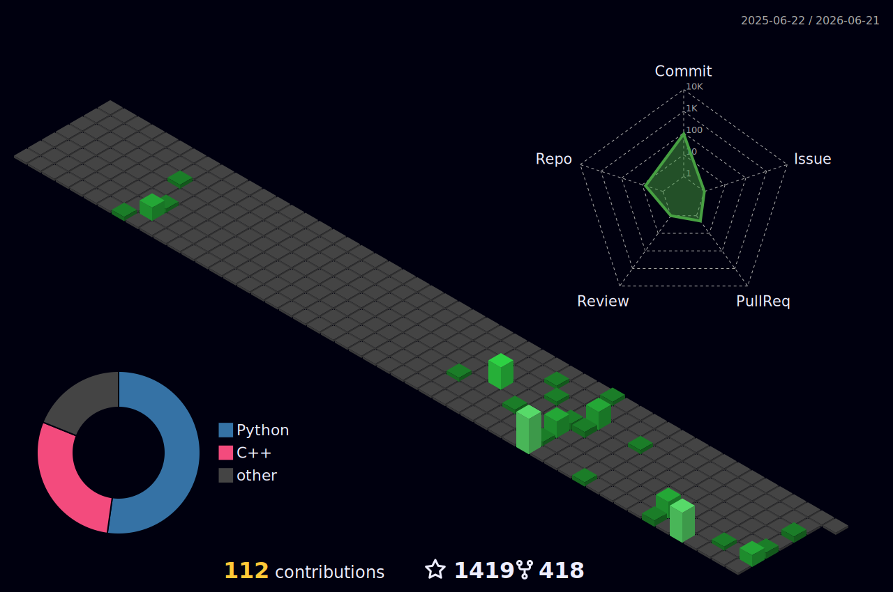

<!-- ═══════════════════════════════════════════════════════════════════════════════════ -->
<!-- ██████╗██╗   ██╗██████╗ ███████╗██████╗ ██╗  ██╗ █████╗ ██╗     ██╗      █████╗ ███╗   ██╗ -->
<!-- ╚══════╝╚═╝   ╚═╝╚═════╝ ╚══════╝╚═╝  ╚═╝╚═╝  ╚═╝╚═╝  ╚═╝╚══════╝╚══════╝╚═╝  ╚═╝╚═╝ ╚═══╝ -->
<!-- ═══════════════════════════════════════════════════════════════════════════════════ -->

<!-- ╔══════════════════════════════════════════════════════════════╗ -->
<!-- ║               www.arjunarz.com                               ║ -->
<!-- ╚══════════════════════════════════════════════════════════════╝ -->
<p align="center">
  <video src="https://github.com/cyberkallan/cyberkallan/raw/main/VN20260304_233249.mp4" width="100%" autoplay loop muted playsinline></video>
</p>

<!-- ANIMATED TYPING HEADER -->
<p align="center">
  <a href="https://github.com/cyberkallan">
    
  </a>
</p>

<!-- PROFILE BADGES -->
<p align="center">
  
  &nbsp;&nbsp;
  
  &nbsp;&nbsp;
  
</p>

<!-- PREMIUM DIVIDER -->


<!-- ╔══════════════════════════════════════════════════════════════╗ -->
<!-- ║                          💀 PROFILE 💀                      ║ -->
<!-- ╚══════════════════════════════════════════════════════════════╝ -->

<h2 align="center">
  
  <samp>&nbsp;HACKER PROFILE&nbsp;</samp>
  
</h2>

<div align="center">

```
╔══════════════════════════════════════════════════════════════════╗
║                                                                  ║
║   ██████╗██╗  ██╗    CYBERKALLAN                                ║
║  ██╔════╝██║ ██╔╝    ═══════════════════════════════             ║
║  ██║     █████╔╝     Role    : Cybersecurity Analyst            ║
║  ██║     ██╔═██╗     Mission : Ethical Hacking & Bug Bounty     ║
║  ╚██████╗██║  ██╗    Status  : Online & Hunting 🔴              ║
║   ╚═════╝╚═╝  ╚═╝    OS      : Kali Linux / Parrot OS          ║
║                       Shell   : zsh / bash                       ║
║                       Editor  : vim / VS Code                    ║
║                       Website : arjunarz.in                     ║
║                                                                  ║
╚══════════════════════════════════════════════════════════════════╝
```

</div>

<br/>


<!-- ╔══════════════════════════════════════════════════════════════╗ -->
<!-- ║                    🛡️ TECH ARSENAL 🛡️                       ║ -->
<!-- ╚══════════════════════════════════════════════════════════════╝ -->

<h2 align="center">
  
  <samp>&nbsp;TECH ARSENAL&nbsp;</samp>
  
</h2>

<h3 align="center">⚔️ Offensive Security & Pentesting</h3>
<p align="center">
  
  
  
  
  
  
  
  
  
</p>

<h3 align="center">💻 Languages & Scripting</h3>
<p align="center">
  
  
  
  
  
  
  
</p>

<h3 align="center">🌐 Web, Cloud & Infrastructure</h3>
<p align="center">
  
  
  
  
  
  
  
</p>

<h3 align="center">🔧 Tools & Databases</h3>
<p align="center">
  
  
  
  
  
  
  
</p>

<br/>

<!-- SKILL ICONS ROW -->
<p align="center">
  
</p>

<br/>


<!-- ╔══════════════════════════════════════════════════════════════╗ -->
<!-- ║              📊 GITHUB STATS DASHBOARD 📊                   ║ -->
<!-- ╚══════════════════════════════════════════════════════════════╝ -->

<h2 align="center">
  
  <samp>&nbsp;GITHUB STATS DASHBOARD&nbsp;</samp>
  
</h2>

<!-- Streak Stats (reliable - no proxy issue) -->
<p align="center">
  <a href="https://github.com/cyberkallan">
    
  </a>
</p>

<!-- GitHub Stats & Top Languages — direct API (renders on-the-fly) -->
<p align="center">
  <a href="https://github.com/cyberkallan">
    
  </a>
  <a href="https://github.com/cyberkallan">
    
  </a>
</p>

<br/>


<!-- ╔══════════════════════════════════════════════════════════════╗ -->
<!-- ║              🐍 CONTRIBUTION SNAKE 🐍                       ║ -->
<!-- ╚══════════════════════════════════════════════════════════════╝ -->

<h2 align="center">
  <samp>&nbsp;🐍 CONTRIBUTION SNAKE 🐍&nbsp;</samp>
</h2>

<p align="center">
  <picture>
    <source media="(prefers-color-scheme: dark)" srcset="https://raw.githubusercontent.com/cyberkallan/cyberkallan/output/github-snake-dark.svg" />
    <source media="(prefers-color-scheme: light)" srcset="https://raw.githubusercontent.com/cyberkallan/cyberkallan/output/github-snake.svg" />
    
  </picture>
</p>

<br/>


<!-- ╔══════════════════════════════════════════════════════════════╗ -->
<!-- ║              📈 CONTRIBUTION CALENDAR 📈                    ║ -->
<!-- ╚══════════════════════════════════════════════════════════════╝ -->

<h2 align="center">
  <samp>&nbsp;📈 3D CONTRIBUTION CALENDAR 📈&nbsp;</samp>
</h2>

<p align="center">
  
</p>

<!-- NOTE: This requires the 3D Contribution Graph workflow to have run at least once -->

<br/>


<!-- ╔══════════════════════════════════════════════════════════════╗ -->
<!-- ║              🏆 GITHUB TROPHIES 🏆                          ║ -->
<!-- ╚══════════════════════════════════════════════════════════════╝ -->

<h2 align="center">
  <samp>&nbsp;🏆 GITHUB TROPHIES 🏆&nbsp;</samp>
</h2>

<!-- Trophies — direct API (renders on-the-fly) -->
<p align="center">
  
</p>

<br/>


<!-- ╔══════════════════════════════════════════════════════════════╗ -->
<!-- ║              🔥 FEATURED PROJECTS 🔥                        ║ -->
<!-- ╚══════════════════════════════════════════════════════════════╝ -->

<h2 align="center">
  
  <samp>&nbsp;FEATURED PROJECTS&nbsp;</samp>
  
</h2>

<!-- Pin cards — direct API (renders on-the-fly) -->
<p align="center">
  <a href="https://github.com/cyberkallan/-">
    
  </a>
  <a href="https://github.com/cyberkallan/inshackle-bot">
    
  </a>
</p>

<p align="center">
  <a href="https://github.com/cyberkallan/IG-blaster">
    
  </a>
  <a href="https://github.com/cyberkallan/cyberkallan">
    
  </a>
</p>

<br/>


<!-- ╔══════════════════════════════════════════════════════════════╗ -->
<!-- ║              📉 ACTIVITY GRAPH 📉                           ║ -->
<!-- ╚══════════════════════════════════════════════════════════════╝ -->

<h2 align="center">
  <samp>&nbsp;📉 ACTIVITY GRAPH 📉&nbsp;</samp>
</h2>

<p align="center">
  
</p>

<br/>


<!-- ╔══════════════════════════════════════════════════════════════╗ -->
<!-- ║              🌐 CONNECT WITH ME 🌐                          ║ -->
<!-- ╚══════════════════════════════════════════════════════════════╝ -->

<h2 align="center">
  
  <samp>&nbsp;CONNECT WITH ME&nbsp;</samp>
  
</h2>

<p align="center">
  <a href="https://github.com/cyberkallan">
    
  </a>
  <a href="https://arjunarz.com">
    
  </a>
  <a href="https://linkedin.com/in/cyberkallan">
    
  </a>
  <a href="https://twitter.com/Cyberkallan">
    
  </a>
  <a href="https://instagram.com/imarjunarz">
    
  </a>
  <a href="https://tryhackme.com/p/cyberkallan">
    
  </a>
  <a href="https://app.hackthebox.com/profile/cyberkallan">
    
  </a>
</p>

<br/>


<!-- ╔══════════════════════════════════════════════════════════════╗ -->
<!-- ║                    🔥 ARJUN ARZ 🔥                     ║ -->
<!-- ╚══════════════════════════════════════════════════════════════╝ -->

<p align="center">
  
</p>

<p align="center">
  
</p>

<!-- ═══════════════════════════════════════════════════════════════════════════════════ -->
<!-- ⚡ POWERED BY: GitHub Actions | capsule-render | streak-stats | skillicons ⚡ -->
<!-- ═══════════════════════════════════════════════════════════════════════════════════ -->
