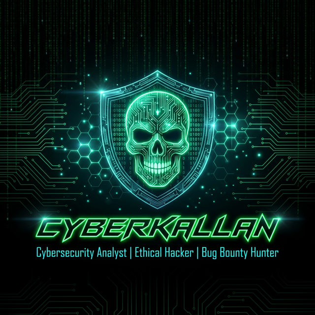

<!-- ═══════════════════════════════════════════════════════════════════════════════════ -->
<!-- ██████╗██╗   ██╗██████╗ ███████╗██████╗ ██╗  ██╗ █████╗ ██╗     ██╗      █████╗ ███╗   ██╗ -->
<!-- ██╔════╝╚██╗ ██╔╝██╔══██╗██╔════╝██╔══██╗██║ ██╔╝██╔══██╗██║     ██║     ██╔══██╗████╗  ██║ -->
<!-- ██║      ╚████╔╝ ██████╔╝█████╗  ██████╔╝█████╔╝ ███████║██║     ██║     ███████║██╔██╗ ██║ -->
<!-- ██║       ╚██╔╝  ██╔══██╗██╔══╝  ██╔══██╗██╔═██╗ ██╔══██║██║     ██║     ██╔══██║██║╚██╗██║ -->
<!-- ╚██████╗   ██║   ██████╔╝███████╗██║  ██║██║  ██╗██║  ██║███████╗███████╗██║  ██║██║ ╚████║ -->
<!--  ╚═════╝   ╚═╝   ╚═════╝ ╚══════╝╚═╝  ╚═╝╚═╝  ╚═╝╚═╝  ╚═╝╚══════╝╚══════╝╚═╝  ╚═╝╚═╝ ╚═══╝ -->
<!-- ═══════════════════════════════════════════════════════════════════════════════════ -->

<!-- PREMIUM BANNER -->
<p align="center">
  
</p>

<!-- ANIMATED TYPING HEADER -->
<p align="center">
  <a href="https://github.com/cyberkallan">
    
  </a>
</p>

<!-- WAVE DIVIDER -->


<!-- ═══════════════ ABOUT ME — HACKER PROFILE CARD ═══════════════ -->

<h2 align="center">💀 HACKER PROFILE 💀</h2>

<div align="center">

```
╔══════════════════════════════════════════════════════════════════╗
║                                                                  ║
║   ██████╗██╗  ██╗    CYBERKALLAN                                ║
║  ██╔════╝██║ ██╔╝    ═══════════════════════════════             ║
║  ██║     █████╔╝     Role    : Cybersecurity Analyst            ║
║  ██║     ██╔═██╗     Mission : Ethical Hacking & Bug Bounty     ║
║  ╚██████╗██║  ██╗    Status  : Online & Hunting 🔴              ║
║   ╚═════╝╚═╝  ╚═╝    OS      : Kali Linux / Parrot OS          ║
║                       Shell   : zsh / bash                       ║
║                       Editor  : vim / VS Code                    ║
║                                                                  ║
╚══════════════════════════════════════════════════════════════════╝
```

</div>

<p align="center">
  
  
  
</p>

<br/>


<!-- ═══════════════ TECH ARSENAL ═══════════════ -->

<h2 align="center">🛡️ TECH ARSENAL 🛡️</h2>

<h3 align="center">⚔️ Offensive Security & Pentesting</h3>
<p align="center">
  
  
  
  
  
  
  
  
  
</p>

<h3 align="center">💻 Languages & Scripting</h3>
<p align="center">
  
  
  
  
  
  
  
</p>

<h3 align="center">🌐 Web, Cloud & Infrastructure</h3>
<p align="center">
  
  
  
  
  
  
  
</p>

<h3 align="center">🔧 Tools & Databases</h3>
<p align="center">
  
  
  
  
  
  
  
</p>

<br/>

<!-- SKILL ICONS ROW -->
<p align="center">
  
</p>

<br/>


<!-- ═══════════════ GITHUB STATS DASHBOARD ═══════════════ -->

<h2 align="center">📊 GITHUB STATS DASHBOARD 📊</h2>

<p align="center">
  
  
</p>

<p align="center">
  
</p>

<br/>


<!-- ═══════════════ CONTRIBUTION SNAKE ═══════════════ -->

<h2 align="center">🐍 CONTRIBUTION SNAKE 🐍</h2>

<p align="center">
  <picture>
    <source media="(prefers-color-scheme: dark)" srcset="https://raw.githubusercontent.com/cyberkallan/cyberkallan/output/github-snake-dark.svg" />
    <source media="(prefers-color-scheme: light)" srcset="https://raw.githubusercontent.com/cyberkallan/cyberkallan/output/github-snake.svg" />
    
  </picture>
</p>

<br/>


<!-- ═══════════════ 3D CONTRIBUTION GRAPH ═══════════════ -->

<h2 align="center">📈 3D CONTRIBUTION CALENDAR 📈</h2>

<p align="center">
  
</p>

<br/>


<!-- ═══════════════ GITHUB TROPHIES ═══════════════ -->

<h2 align="center">🏆 GITHUB TROPHIES 🏆</h2>

<p align="center">
  
</p>

<br/>


<!-- ═══════════════ FEATURED PROJECTS ═══════════════ -->

<h2 align="center">🔥 FEATURED PROJECTS 🔥</h2>

<p align="center">
  <a href="https://github.com/cyberkallan/-">
    
  </a>
  <a href="https://github.com/cyberkallan/inshackle-bot">
    
  </a>
</p>

<p align="center">
  <a href="https://github.com/cyberkallan/IG-blaster">
    
  </a>
  <a href="https://github.com/cyberkallan/cyberkallan">
    
  </a>
</p>

<br/>


<!-- ═══════════════ HACKER TERMINAL ═══════════════ -->

<h2 align="center">💀 HACKER TERMINAL 💀</h2>

<div align="center">

```bash
┌──(cyberkallan㉿kali)-[~]
└─$ whoami
cyberkallan — Cybersecurity Analyst | Ethical Hacker | Bug Bounty Hunter

┌──(cyberkallan㉿kali)-[~]
└─$ cat /etc/hacker_profile
╭─────────────────────────────────────────────────────────╮
│                                                         │
│   ▄▄▄▄▄▄▄▄▄▄▄▄▄▄▄▄▄▄▄▄▄▄▄▄▄▄▄▄▄▄▄▄▄▄▄▄▄▄▄▄▄▄▄▄▄     │
│   █  SYSTEM INFORMATION                           █     │
│   ▀▀▀▀▀▀▀▀▀▀▀▀▀▀▀▀▀▀▀▀▀▀▀▀▀▀▀▀▀▀▀▀▀▀▀▀▀▀▀▀▀▀▀▀▀     │
│                                                         │
│   🔹 Codename    : CyberKallan                         │
│   🔹 OS          : Kali Linux / Parrot OS               │
│   🔹 Kernel      : 6.1.0-kali9-amd64                   │
│   🔹 Uptime      : Since Day One                       │
│   🔹 Shell       : /bin/zsh                             │
│   🔹 Terminal    : Custom Hacker Suite                  │
│   🔹 Skills      : Pentesting, OSINT, Web Hacking      │
│   🔹 Weapons     : Metasploit, Burp Suite, Nmap        │
│   🔹 Status      : 🟢 Active & Hunting                 │
│                                                         │
╰─────────────────────────────────────────────────────────╯

┌──(cyberkallan㉿kali)-[~]
└─$ nmap -sV --script=vuln target.com
Starting Nmap 7.94 ( https://nmap.org )
[*] Scanning target.com (192.168.1.1)...
[*] Discovered 12 open ports
[*] Running vulnerability scripts...
[+] CVE-2024-XXXX : CRITICAL vulnerability found!
[+] Generating exploit payload...
[+] Shell access obtained!
[✓] Report generated → /reports/target_assessment.pdf

┌──(cyberkallan㉿kali)-[~]
└─$ echo "Happy Hacking! 🏴‍☠️"
```

</div>

<br/>


<!-- ═══════════════ ACTIVITY GRAPH ═══════════════ -->

<h2 align="center">📉 ACTIVITY GRAPH 📉</h2>

<p align="center">
  
</p>

<br/>


<!-- ═══════════════ CONNECT WITH ME ═══════════════ -->

<h2 align="center">🌐 CONNECT WITH ME 🌐</h2>

<p align="center">
  <a href="https://github.com/cyberkallan">
    
  </a>
  <a href="https://arjunarz.com">
    
  </a>
  <a href="https://linkedin.com/in/cyberkallan">
    
  </a>
  <a href="https://twitter.com/Cyberkallan">
    
  </a>
  <a href="https://instagram.com/imarjunarz">
    
  </a>
  <a href="https://tryhackme.com/p/cyberkallan">
    
  </a>
  <a href="https://app.hackthebox.com/profile/cyberkallan">
    
  </a>
</p>

<br/>


<!-- ═══════════════ RANDOM DEV QUOTE ═══════════════ -->

<h2 align="center">💬 HACKER QUOTE 💬</h2>

<p align="center">
  
</p>

<br/>


<!-- ═══════════════ FOOTER ═══════════════ -->

<p align="center">
  
</p>

<p align="center">
  
</p>

<!-- ═══════════════════════════════════════════════════════════════════════════════════ -->
<!-- ⚡ POWERED BY: GitHub Actions | Platane/snk | github-readme-stats | shields.io ⚡ -->
<!-- ═══════════════════════════════════════════════════════════════════════════════════ -->
